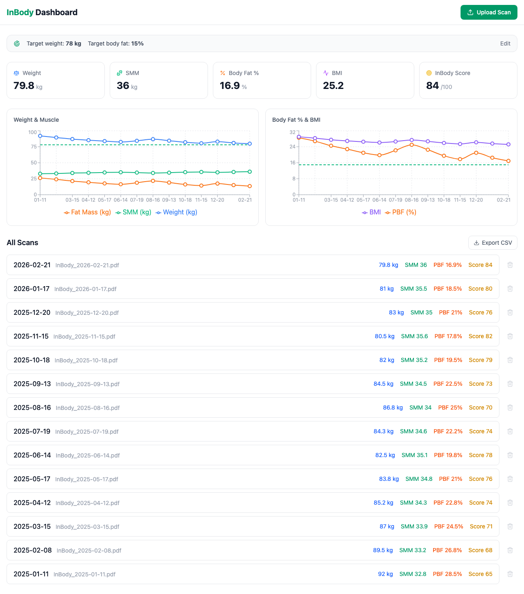
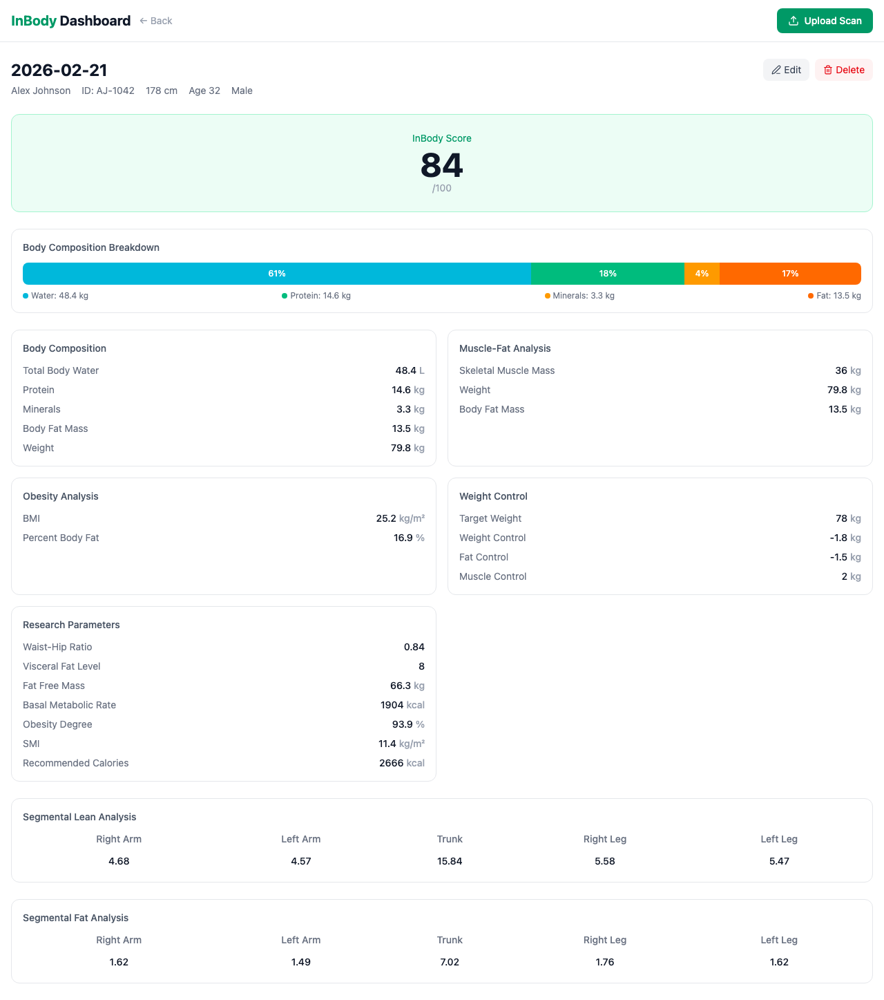

# InBody Dashboard

Personal dashboard for tracking InBody body composition scan results. Upload InBody PDFs or images — the app extracts metrics via OCR and displays trends over time.





## Features

- Upload InBody scan PDFs or photos for automatic data extraction (OCR)
- Dashboard with summary cards, trend charts, and scan history
- Detailed scan view: body composition, muscle-fat analysis, obesity analysis, weight control, research parameters, segmental lean/fat, and impedance data
- Edit scanned values manually if OCR misreads
- Export scan list to CSV
- Delete scans from list or detail view

## Tech Stack

- **Frontend**: React 19, TypeScript, Tailwind CSS 4, Recharts, Vite
- **Backend**: FastAPI, SQLAlchemy (SQLite), pdfplumber, pytesseract

## Setup

### Backend

```bash
cd backend
python -m venv venv
source venv/bin/activate
pip install -r requirements.txt
uvicorn app.main:app --reload
```

Requires system dependencies for OCR: `tesseract` and `poppler` (for `pdf2image`).

```bash
# macOS
brew install tesseract poppler
```

### Frontend

```bash
cd frontend
npm install
npm run dev
```

The Vite dev server proxies `/api` requests to the backend at `localhost:8000`.

## Privacy

This app processes health data (InBody scans). The uploaded files and extracted data stay local — there are no external API calls. The `backend/uploads/` directory and `*.db` database files are gitignored to prevent accidental exposure of personal health information.

## License

Private / personal use.
